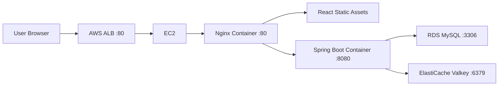
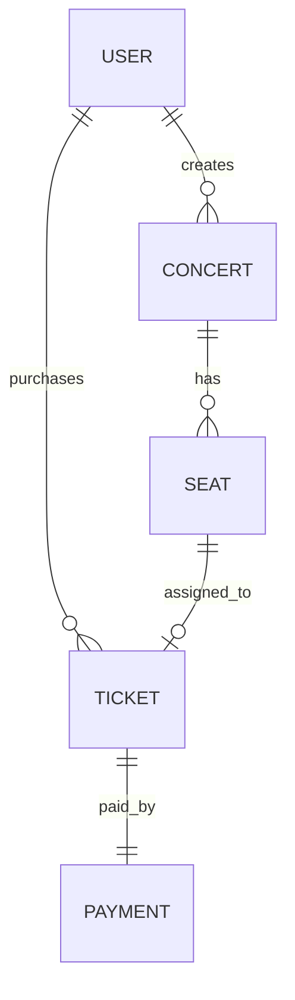

# Book Tickets

[](https://github.com/choonngg/book-tickets/actions/workflows/ci.yml)
[](https://github.com/choonngg/book-tickets/actions/workflows/deploy.yml)

동시 좌석 예매 상황에서 **중복 구매를 방지하는 것**을 핵심 목표로 만든 티켓 예매 플랫폼입니다.  
팬은 공연을 조회하고 좌석을 예매할 수 있고, 아티스트는 공연을 등록하고 관리할 수 있습니다.

이 프로젝트는 단순 CRUD를 넘어서 좌석 예매의 동시성 문제를 다루고, Redisson 분산 락 기반 구매 전략과 AWS 배포까지 검증하는 것을 목표로 합니다.

## Highlights

- FAN / ARTIST 역할 기반 사용자 플로우
- JWT 기반 인증과 refresh token 흐름
- 공연 생성, 공연 목록 조회, 구역 기반 좌석 조회
- 예매 가능 좌석과 예매 불가 좌석 구분
- 티켓 예매와 내 티켓 조회
- 동일 좌석 중복 예매 방지
- Optimistic / Pessimistic / Distributed lock 구매 전략 비교 가능 구조
- Redisson + ElastiCache Valkey 기반 분산 락 적용
- GitHub Actions 기반 CI/CD
- AWS ALB + EC2 Docker Compose + RDS MySQL + ElastiCache Valkey 배포 검증

## Tech Stack

| Area | Stack |
|---|---|
| Backend | Java 25, Spring Boot 4, Spring Security, Spring Data JPA, Spring Data Redis |
| Database | MySQL, H2 for tests |
| Locking | Redisson, Redis/Valkey distributed lock |
| Auth | JWT, Spring Security |
| Frontend | React 19, TypeScript, Vite, Vitest, Testing Library |
| Infra | Docker, Docker Compose, Nginx |
| Cloud | AWS EC2, ALB, RDS MySQL, ElastiCache Valkey, Elastic IP |
| CI/CD | GitHub Actions, GHCR |
| Test | JUnit 5, Mockito, Spring MVC Test, Vitest |

## Architecture



Production traffic enters through the ALB and reaches Nginx on EC2. Nginx serves the React app and proxies `/api/**` plus `/actuator/health` to the Spring Boot backend.

## Core Flows

### Artist

```text
회원가입 -> 로그인 -> 공연 생성 -> 공연 목록 확인
```

### Fan

```text
회원가입 -> 로그인 -> 공연 새로고침 -> 공연 선택
-> 예매 가능 좌석 확인 -> 예매 -> 내 티켓 확인
```

## Domain Model



## API Overview

| Domain | Endpoints |
|---|---|
| Auth | `POST /api/auth/signup`, `POST /api/auth/login`, `POST /api/auth/logout`, `POST /api/auth/token/refresh` |
| User | `GET /api/users/me`, `PATCH /api/users/me`, `DELETE /api/users/me` |
| Concert | `GET /api/concerts`, `GET /api/concerts/{concertId}`, `POST /api/concerts`, `PATCH /api/concerts/{concertId}`, `PATCH /api/concerts/{concertId}/cancel`, `GET /api/concerts/{concertId}/stats` |
| Seat | `GET /api/concerts/{concertId}/seats`, `GET /api/concerts/{concertId}/seats/available` |
| Ticket | `POST /api/tickets`, `GET /api/tickets/me`, `GET /api/tickets/{ticketId}`, `PATCH /api/tickets/{ticketId}/cancel` |

`POST /api/tickets` requires an `Idempotency-Key` request header.

## Purchase Strategy

Ticket purchase is routed by the `TICKET_PURCHASE_STRATEGY` setting.

| Strategy | Purpose |
|---|---|
| `optimistic` | Compare optimistic locking behavior under concurrent seat purchase |
| `pessimistic` | Compare DB row lock behavior |
| `distributed` | Use Redisson distributed lock for production-like deployment |

The AWS deployment uses:

```text
TICKET_PURCHASE_STRATEGY=distributed
```

## Local Development

### Requirements

- Java 25
- Node.js 24
- MySQL
- Redis or Valkey

### Backend

Set the required environment variables first.

```bash
SPRING_DATASOURCE_URL=jdbc:mysql://localhost:3306/ticket?serverTimezone=Asia/Seoul&characterEncoding=UTF-8
SPRING_DATASOURCE_USERNAME=root
SPRING_DATASOURCE_PASSWORD=<password>
SPRING_DATA_REDIS_HOST=localhost
SPRING_DATA_REDIS_PORT=6379
SPRING_DATA_REDIS_SSL_ENABLED=false
JWT_SECRET=<secret-at-least-32-bytes>
JWT_ACCESS_TOKEN_MINUTES=30
JWT_REFRESH_TOKEN_DAYS=7
TICKET_PURCHASE_STRATEGY=distributed
PAYMENT_TIMEOUT_MILLIS=5000
```

Run:

```bash
cd backend
./gradlew bootRun
```

On Windows:

```powershell
cd backend
.\gradlew.bat bootRun
```

### Frontend

```bash
cd frontend
npm ci
npm run dev
```

## Test

### Backend

```bash
cd backend
./gradlew --no-daemon test
```

On Windows:

```powershell
cd backend
.\gradlew.bat --no-daemon test
```

### Frontend

```bash
cd frontend
npm test
npm run build
```

### Production Compose Config

```bash
docker compose -f docker-compose.prod.yml config
```

## Deployment

The deployed environment was verified with:

```text
AWS ALB
-> EC2 Docker Compose
-> Nginx
-> Spring Boot
-> RDS MySQL
-> ElastiCache Valkey
```

GitHub Actions workflow:

```text
Verify -> Build and Push Images -> Deploy to EC2
```

Deployment images are published to GHCR:

```text
ghcr.io/choonngg/book-tickets-backend:<commit-sha>
ghcr.io/choonngg/book-tickets-nginx:<commit-sha>
```

### Required Deployment Secrets

| Secret | Description |
|---|---|
| `EC2_HOST` | EC2 Elastic IP or public DNS for SSH deployment |
| `EC2_USER` | EC2 SSH user, for example `ec2-user` |
| `EC2_SSH_KEY` | Private key used by GitHub Actions |
| `REGISTRY_USERNAME` | GitHub username |
| `REGISTRY_TOKEN` | Token used by EC2 to pull GHCR images |
| `SPRING_DATASOURCE_URL` | RDS MySQL JDBC URL |
| `SPRING_DATASOURCE_USERNAME` | RDS username |
| `SPRING_DATASOURCE_PASSWORD` | RDS password |
| `SPRING_DATA_REDIS_HOST` | ElastiCache Valkey endpoint host only |
| `SPRING_DATA_REDIS_PORT` | Redis/Valkey port, usually `6379` |
| `SPRING_DATA_REDIS_SSL_ENABLED` | `false` for the verified Valkey environment |
| `JWT_SECRET` | JWT signing secret |
| `JWT_ACCESS_TOKEN_MINUTES` | Access token lifetime |
| `JWT_REFRESH_TOKEN_DAYS` | Refresh token lifetime |
| `TICKET_PURCHASE_STRATEGY` | `distributed` for AWS deployment |
| `PAYMENT_TIMEOUT_MILLIS` | Mock payment timeout |

## Deployment Notes

Issues found and resolved during deployment:

- `backend/gradlew` needed executable permission for Ubuntu GitHub Actions runners.
- `SPRING_DATA_REDIS_HOST` must not include `:6379`.
- `SPRING_DATA_REDIS_SSL_ENABLED` must match the ElastiCache Valkey TLS setting.
- Production healthcheck needed a longer `start_period` because the backend startup on AWS was slower than local startup.
- ALB Availability Zone and Target Group configuration must match the EC2 subnet/AZ; otherwise targets can remain `unused` and the browser may show `503`.

## Project Structure

```text
.
├── backend/                 # Spring Boot API
├── frontend/                # React/Vite frontend
├── nginx/                   # Nginx reverse proxy config
├── .github/workflows/       # CI/CD workflows
├── Dockerfile.backend
├── Dockerfile.nginx
├── docker-compose.prod.yml
└── .env.example
```

## Current Status

- Backend test: passing
- Frontend test/build: passing
- Docker build: passing
- GitHub Actions CI: passing
- GitHub Actions Deploy: passing
- AWS ALB target: healthy
- Verified public user flows: Artist flow and Fan purchase flow
